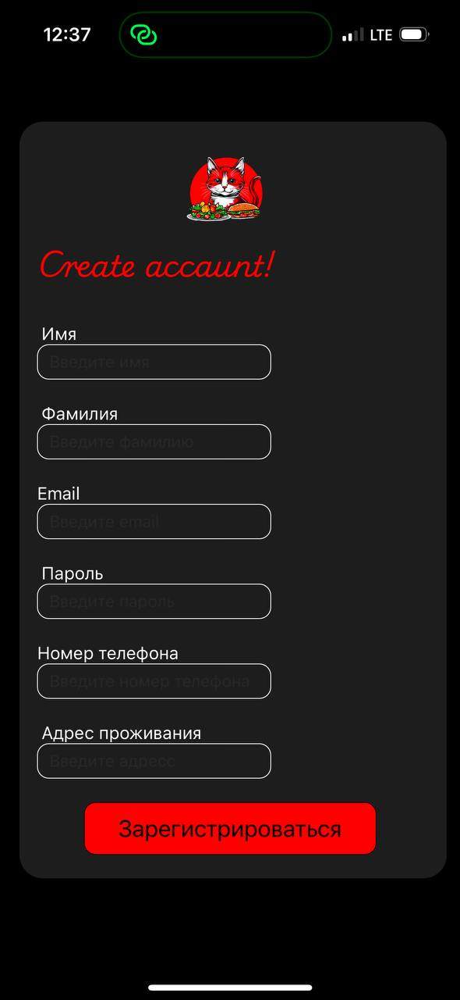
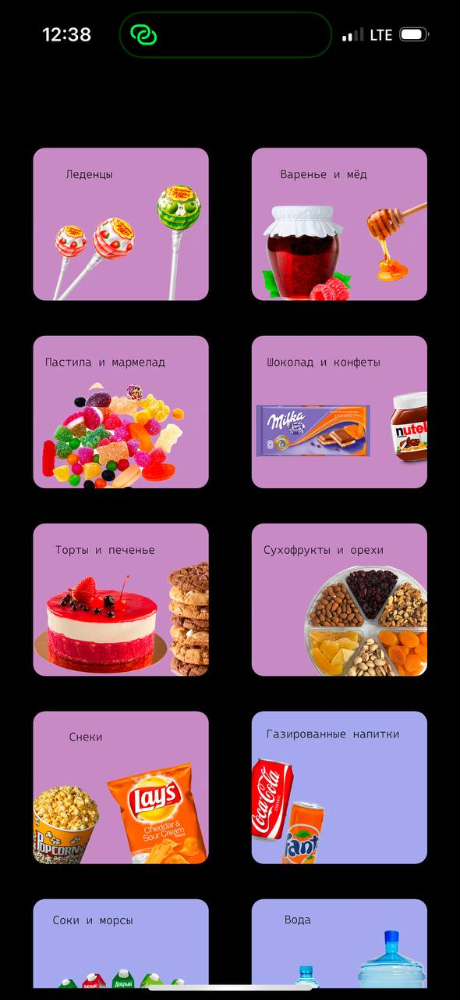

# DeliveryCat
DeliveryCat — это платформа для доставки еды, которая предназначена для телефонов

## Технологии
- **Frontend:** React Native  
- **Backend:** Node.js, Express  
- **База данных:** PostgreSQL (через Sequelize)  
- **Аутентификация:** JWT (JSON Web Token)

 ## Структура проекта

`/server` — Backend на Express с API, WebSocket-сервер и логикой игры

  ## Интерфейс 
  
  
  
  
  
  
  
  

  ## Контакты
  Автор: Настя Лапинская
Email: anlapinskaya@gmail.com

  
